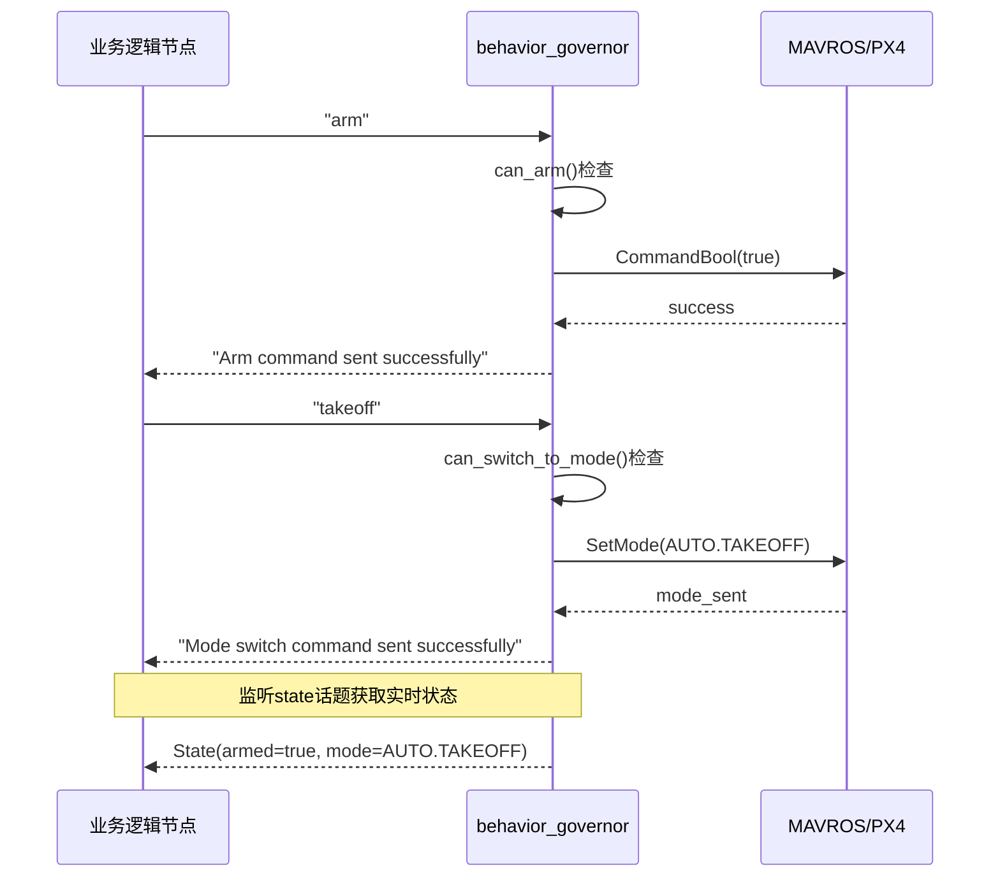

# Behavior Governor 接口文档

## 概述
`behavior_governor`节点提供原子行为执行和安全检查的接口层，作为MAVROS和高级业务逻辑之间的桥梁。

## 对外接口

### 1. 话题接口 (Topics)

#### 输入话题
- **`behavior_governor/command`** (`std_msgs/msg/String`)
  - 描述：接收原子命令
  - 频率：按需
  - 格式：字符串命令

#### 输出话题
- **`behavior_governor/status`** (`std_msgs/msg/String`)
  - 描述：命令执行状态反馈
  - 频率：每次命令执行时
  - 格式：状态消息字符串

- **`behavior_governor/state`** (`mavros_msgs/msg/State`)
  - 描述：实时飞行器状态
  - 频率：10Hz
    - 内容：armed, mode, connected等状态

### 2. 服务接口 (Services)

#### 航点推送服务
- **`behavior_governor/push_waypoints`** (`behavior_governor/srv/PushWaypoints`)
  - 描述：推送航点任务到飞行器
  - 请求参数：
    - `waypoints` (sensor_msgs/NavSatFix[]): 航点数组 (经纬度+高度)
    - `hold_time` (float64): 每个航点的悬停时间 (秒)
    - `acceptance_radius` (float64): 航点接受半径 (米)
    - `yaws` (float64[]): 可选的偏航角数组 (度)
  - 响应：
    - `success` (bool): 是否成功推送
    - `message` (string): 状态消息
    - `waypoints_pushed` (uint32): 实际推送的航点数量

### 3. 支持的原子命令

| 命令 | 功能 | 前置条件 | 状态反馈 |
|------|------|----------|----------|
| `arm` | 解锁飞行器 | 地面 + 未解锁 | "Arm command sent successfully" / 错误消息 |
| `disarm` | 锁定飞行器 | 地面 + 已解锁 | "Disarm command sent successfully" / 错误消息 |
| `takeoff` | 切换到AUTO.TAKEOFF | 已解锁 + 地面 | "Mode switch command sent successfully" / 错误消息 |
| `land` | 切换到AUTO.LAND | 空中 | "Mode switch command sent successfully" / 错误消息 |
| `hold` / `loiter` | 切换到AUTO.LOITER | 无 | "Mode switch command sent successfully" / 错误消息 |
| `rtl` | 切换到AUTO.RTL | 无 | "Mode switch command sent successfully" / 错误消息 |
| `mission` | 切换到AUTO.MISSION | 已解锁 | "Mode switch command sent successfully" / 错误消息 |
| `clear_waypoints` | 清除所有航点 | 状态已同步 | "Waypoints cleared successfully" / 错误消息 |

### 3. 使用示例

#### 航点推送服务使用示例

```python
#!/usr/bin/env python3
import rclpy
from rclpy.node import Node
from sensor_msgs.msg import NavSatFix
from behavior_governor.srv import PushWaypoints

class WaypointExample(Node):
    def __init__(self):
        super().__init__('waypoint_example')
        self.waypoint_client = self.create_client(PushWaypoints, 'behavior_governor/push_waypoints')
        
    def push_square_mission(self):
        # Wait for service
        self.waypoint_client.wait_for_service()
        
        # Create waypoints
        waypoints = []
        base_lat, base_lon = 40.4141646, -79.9475044
        
        # Square pattern
        coords = [
            (base_lat, base_lon),                    # Start
            (base_lat + 0.00045, base_lon),          # North
            (base_lat + 0.00045, base_lon + 0.00060), # Northeast  
            (base_lat, base_lon + 0.00060),          # East
            (base_lat, base_lon)                     # Return
        ]
        
        for lat, lon in coords:
            wp = NavSatFix()
            wp.latitude = lat
            wp.longitude = lon
            wp.altitude = 10.0
            waypoints.append(wp)
            
        # Create request
        request = PushWaypoints.Request()
        request.waypoints = waypoints
        request.hold_time = 2.0
        request.acceptance_radius = 1.0
        request.yaws = []  # No yaw control
        
        # Call service
        future = self.waypoint_client.call_async(request)
        rclpy.spin_until_future_complete(self, future)
        
        response = future.result()
        if response.success:
            print(f"Pushed {response.waypoints_pushed} waypoints successfully")
        else:
            print(f"Failed: {response.message}")
```

#### Python业务逻辑节点示例

```python
#!/usr/bin/env python3
import rclpy
from rclpy.node import Node
from std_msgs.msg import String
from mavros_msgs.msg import State
from sensor_msgs.msg import NavSatFix
import time

class MissionExecutor(Node):
    def __init__(self):
        super().__init__('mission_executor')
        
        # 命令发布器
        self.cmd_pub = self.create_publisher(String, 'behavior_governor/command', 10)
        
        # 状态订阅器
        self.status_sub = self.create_subscription(
            String, 'behavior_governor/status', 
            self.status_callback, 10)
        
        self.state_sub = self.create_subscription(
            State, 'behavior_governor/state',
            self.state_callback, 10)
        
        self.current_state = None
        self.last_status = None
        
    def state_callback(self, msg):
        """实时跟踪飞行器状态"""
        self.current_state = msg
        
    def status_callback(self, msg):
        """接收命令执行反馈"""
        self.last_status = msg.data
        self.get_logger().info(f'Status: {msg.data}')
        
    def send_command(self, cmd):
        """发送原子命令"""
        msg = String()
        msg.data = cmd
        self.cmd_pub.publish(msg)
        self.get_logger().info(f'Sent command: {cmd}')
        
    def wait_for_armed(self, timeout=10):
        """等待解锁完成"""
        start = time.time()
        while time.time() - start < timeout:
            if self.current_state and self.current_state.armed:
                return True
            rclpy.spin_once(self, timeout_sec=0.1)
        return False
        
    def execute_simple_mission(self):
        """执行简单任务流程"""
        # 步骤1: 解锁
        self.send_command('arm')
        if not self.wait_for_armed():
            self.get_logger().error('Arm failed')
            return
            
        # 步骤2: 起飞
        time.sleep(1)
        self.send_command('takeoff')
        time.sleep(10)  # 等待起飞完成
        
        # 步骤3: 悬停
        self.send_command('hold')
        time.sleep(5)
        
        # 步骤4: 降落
        self.send_command('land')
        time.sleep(15)  # 等待降落
        
        # 步骤5: 锁定
        self.send_command('disarm')

def main():
    rclpy.init()
    executor = MissionExecutor()
    executor.execute_simple_mission()
    rclpy.shutdown()

if __name__ == '__main__':
    main()
```

#### C++业务逻辑节点示例

```cpp
#include <rclcpp/rclcpp.hpp>
#include <std_msgs/msg/string.hpp>
#include <mavros_msgs/msg/state.hpp>

class MissionExecutor : public rclcpp::Node {
public:
    MissionExecutor() : Node("mission_executor") {
        cmd_pub_ = create_publisher<std_msgs::msg::String>("behavior_governor/command", 10);
        status_sub_ = create_subscription<std_msgs::msg::String>(
            "behavior_governor/status", 10,
            [this](const std_msgs::msg::String::SharedPtr msg) {
                RCLCPP_INFO(get_logger(), "Status: %s", msg->data.c_str());
            });
        state_sub_ = create_subscription<mavros_msgs::msg::State>(
            "behavior_governor/state", 10,
            [this](const mavros_msgs::msg::State::SharedPtr msg) {
                current_armed_ = msg->armed;
                current_mode_ = msg->mode;
            });
    }
    
    void send_command(const std::string& cmd) {
        auto msg = std_msgs::msg::String();
        msg.data = cmd;
        cmd_pub_->publish(msg);
    }
    
private:
    rclcpp::Publisher<std_msgs::msg::String>::SharedPtr cmd_pub_;
    rclcpp::Subscription<std_msgs::msg::String>::SharedPtr status_sub_;
    rclcpp::Subscription<mavros_msgs::msg::State>::SharedPtr state_sub_;
    bool current_armed_ = false;
    std::string current_mode_;
};
```

### 4. 典型使用流程



### 5. 接口限制

#### 当前限制
1. **航点推送**：`push_waypoints()`函数存在但未对外暴露，需要通过服务接口暴露
2. **批量操作**：不支持原子操作的批量执行
3. **同步等待**：命令是异步的，需要通过状态话题轮询结果

#### 建议的扩展
1. 添加航点推送服务：`behavior_governor/push_waypoints`
2. 添加综合状态话题，包含altitude等信息
3. 考虑添加action接口用于长时间操作

### 6. 安全保证

所有命令都经过以下安全检查：
- 状态同步验证
- 前置条件检查
- 参数合法性验证
- 超时保护
- 错误处理和反馈

### 7. 与其他节点的协作

```
┌─────────────────────────────┐
│     高级业务逻辑节点          │
│  (路径规划、任务调度等)       │
└──────────┬──────────────────┘
           │ 字符串命令
           ▼
┌─────────────────────────────┐
│     behavior_governor       │
│   (原子操作 + 安全检查)       │
└──────────┬──────────────────┘
           │ MAVROS服务/话题
           ▼
┌─────────────────────────────┐
│        MAVROS/PX4           │
└─────────────────────────────┘
```

## 最佳实践

1. **状态监听**：始终订阅`behavior_governor/state`话题以获取实时状态
2. **错误处理**：监听`behavior_governor/status`话题处理错误
3. **命令顺序**：确保命令按正确顺序发送（如先arm再takeoff）
4. **等待确认**：发送命令后等待状态变化确认
5. **超时处理**：为每个操作设置合理的超时时间
